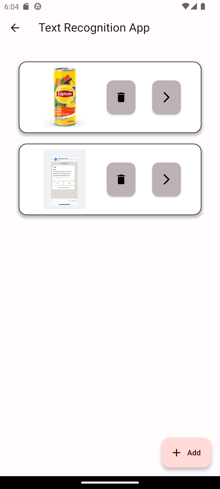
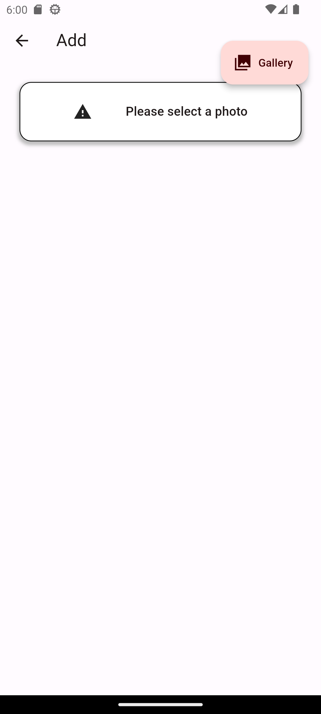
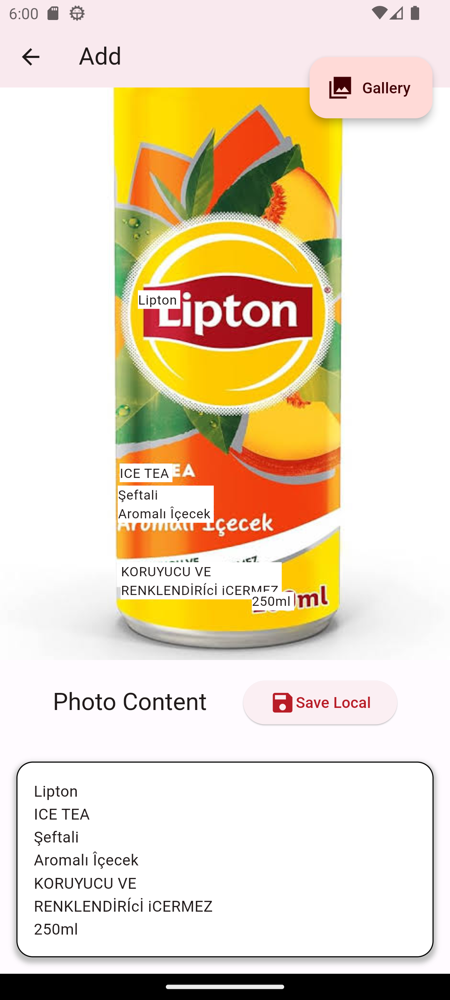
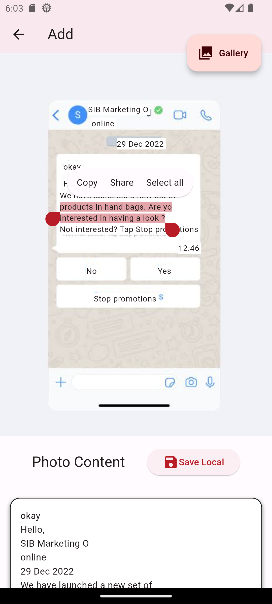
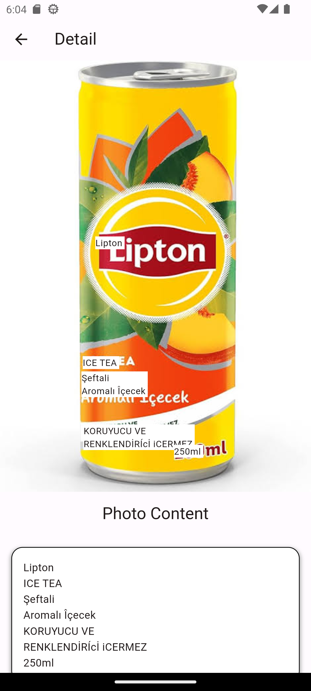

# Flutter Text Recognition App

<b>Text Recognition App</b> 
-Used Provider, Sqflite , Google ML Kit Text Recognition and image_picker 
-You can run the code for more explore. 
-These are some of the screenshots of my project.  

